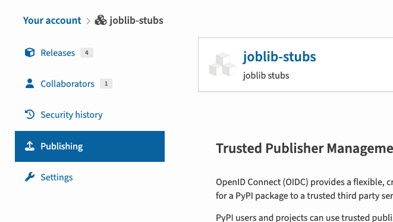
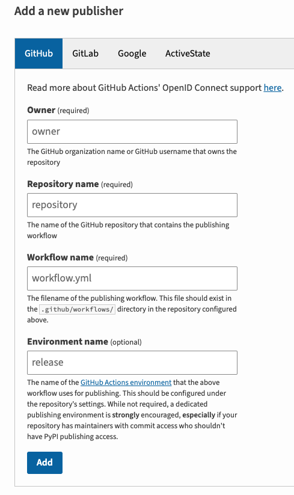

## 패키지 배포는 어렵지 않다
파이썬 패키지를 배포하는 것은 굉장히 간단하다.
`pyproject.toml`에 적합한 메타 데이터만 잘 입력되어 있다면,
다음 명령어로 빌드와 배포를 할 수 있다.
```bash
python -m build
python -m twine upload dist/* --non-interactive --username __token__ --password <pypi 토큰>
```

하지만 보안상 아쉬운 부분이 있는데, 바로 토큰 발행과 보관이다.
보통 배포를 위한 토큰은 한번 발행하고 오래 사용하게 되는데,
만약 그 토큰이 제 3자에게 노출된다면, 이는 굉장한 보안 위협으로 다가올 수 있다.

이를 해결하기 위해 `pypi`에서 제시하는 방법은 [`OIDC`](https://openid.net/connect/)를 사용하는 것이며,
이때 `pypi`에서 사용하는 `OIDC`를 `Trusted Publisher`라고 한다.

## Trusted Publisher를 사용하는 방법
### 1. Trusted Publisher 설정
이미 배포된 적 있는 패키지라면 다음 `pypi` 설정 화면에서 현재 사용중인 `CI` 서비스를 추가할 수 있다.





[공식 문서](https://docs.pypi.org/trusted-publishers/)에 굉장히 상세하게 작성되어 있으므로, 더 알아보고 싶다면 공식 문서를 확인하면 된다.

신규 프로젝트를 생성하면서 [함께 적용](https://docs.pypi.org/trusted-publishers/creating-a-project-through-oidc/)할 수도 있다.
### 2. Trusted Publisher 적용
`Trusted Publisher`로 지정한 `CI`서비스에서 토큰을 발행하여 배포가 가능하도록 수정해야한다.

`Github Action`의 경우 다음과 같은 항목을 추가하면 된다.
```yaml
# 생략
jobs:
  publish:
    # 생략
    environment: # Trusted Publisher 설정에서 지정한 환경(지정하지 않았다면 생략)
    permissions:
      id-token: write # 필수

    steps:
      # 빌드 과정 생략(필수)
      - name: Publish package distributions to PyPI
        uses: pypa/gh-action-pypi-publish@release/v1
```

빌드 과정은 다른 `step`에서 이미 실행이 되어 있어야 하며,
빌드 결과물은 `dist/*` 하위 경로에 있어야 한다.

이 설정만으로 토큰 발행부터 배포, 토큰 말소까지 자동으로 진행된다.

### 3. 사용 예시
현재 사용중인 [워크플로우 파일](https://github.com/phi-friday/airflow-serde-polars/blob/b0c4bb126c683f985160ef247eaea200cda14c97/.github/workflows/publish.yaml)을 예시로 글을 마무리 한다.
```yaml
name: Publish Package

on:
  release:
    types: [created]

jobs:
  publish:
    runs-on: ubuntu-latest
    name: "Publish library"
    environment: publish
    permissions: 
      id-token: write

    steps:
      - name: Check out
        uses: actions/checkout@v4
        with:
          token: "${{ secrets.GITHUB_TOKEN }}"
          fetch-depth: 0

      - name: Set up uv
        run: curl -LsSf https://astral.sh/uv/install.sh | sh

      - name: Build package
        run: uv build

      - name: Publish package distributions to PyPI
        id: publish-pypi
        uses: pypa/gh-action-pypi-publish@release/v1
```
